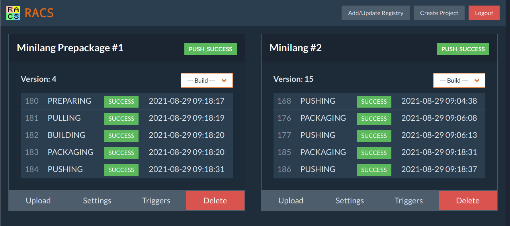

.. include:: <isonum.txt>

Racs
====

Overview
--------

``racs`` (Raja's Attempt at a Continuous Something) is a simple tool for building and deploying OCI images (docker, podman, etc) from git repositories.

It is deliberately minimal in options, with a fixed set of build steps for all projects. Unlike many other continuous build tools, ``racs`` is designed for incremental builds with tools such as ``make``, ``gradle`` and of course `rabs <https://rabs.readthedocs.io>`_.

Features
--------

``racs`` provides the following features:

* Simple web UI and API, including webhooks for pulling and building projects.
* Support for incremental builds. Every project is given its own working directory that persists between builds. The UI and API provide commands for emptying the working directory and performing a clean checkout if required.
* Projects can trigger other projects after each build. This allows for more complex project build workflows.
* Build scripts can be uploaded outside of the git repository. This means ``racs`` can work with existing projects without requiring any changes to their codebases.

Limitations
-----------

``racs`` has several limitations, some due to implementation time constraints and others intentional:

* Hard-coded to use ``podman`` for all image builds. It is expected that ``racs`` is running on its own server or container with a working ``podman`` available. This may become configurable in the future.
* Only supports PAM based authentication, authenticating against the local users. With ``racs`` running on its own server, this should be sufficient. This may become configurable in the future.
* Fixed build steps for all projects: *clean* |rarr| *clone* |rarr| *prepare* |rarr| *pull* |rarr| *build* |rarr| *pacakge* |rarr| *push*.

Installation
------------

``racs`` is written in ``go`` so assuming ``go`` is already installed on a machine, building ``racs`` is simply:

.. code-block:: console

   $ git clone https://github.com/wrapl/racs.git
   $ cd racs
   $ go build
   
The result ``racs`` executable should then be run in the desired directory:

.. code-block:: console

   $ cd /path/to/projects
   $ /path/to/racs -port 8080 -ssl-cert ssl.crt -ssl-key ssl.key -no-login true

.. toctree::
   :maxdepth: 2
   :caption: Contents:
